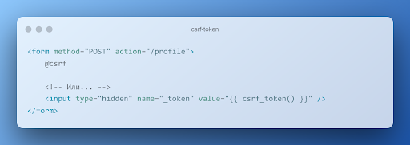
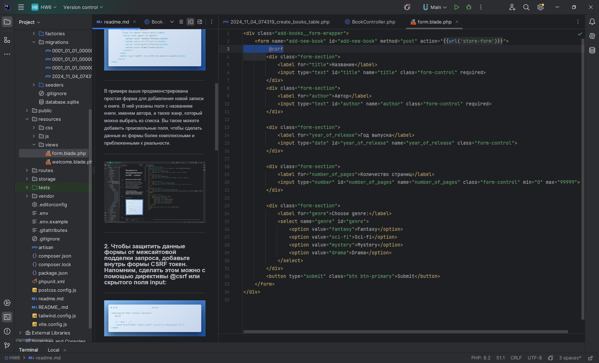
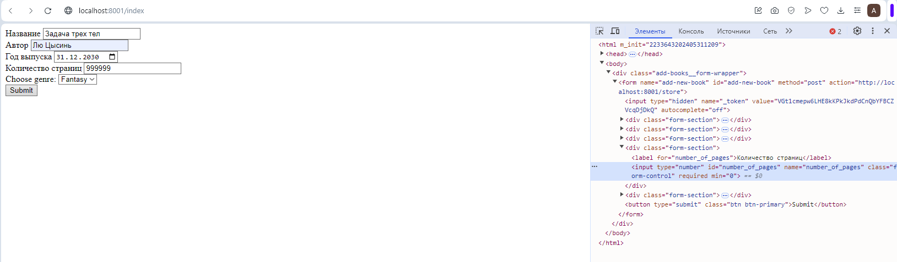

# Продвинутое программирование на PHP — Laravel
## Домашняя работа №6

В этой практической работе вы создадите форму по добавлению новой книги в книжный каталог. Форма будет создаваться внутри шаблона. Данные из формы будут записываться в соответствующие поля базы данных с помощью модели Eloquent.

### 1. Внутри директории resources/view корневого каталога проекта создайте новый блейд-шаблон с именем form.blade.php.

---
   Пример формы:

---

В примере выше продемонстрирована простая форма для добавления новой записи о книге. В ней указаны поля с названием книги, именем автора, а также жанр, который можно выбрать из списка. Вы также можете добавить произвольные поля, чтобы сделать данные из формы более комплексными и приближенными к реальности.

---

---

### 2. Чтобы защитить данные формы от межсайтовой подделки запроса, добавьте внутрь формы CSRF токен. Напомним, сделать этом можно с помощью директивы @csrf или скрытого поля input:

---

---

---

### 3. Свяжите данные полей формы с моделью Laravel. Для этого создайте новую модель. Сделать это можно из командной строки с помощью artisan-команды:

---

Напомним, что флаг -mfsc создаст модель, наполнитель, контроллер и файл миграции.

---

---

### 4. Чтобы данные из формы корректно записывались в соответствующие поля базы данных, опишите схему базы данных в методе up():

---

---

---

Чтобы в базе данных появились соответствующие поля, не забудьте повторно запустить миграции в базе данных, воспользовавшись соответствующей командой artisan.

---

---

### 5. Внутри файла /routes/web.php опишите новый роут (метод GET), который будет вызывать метод index контроллера BookController по url /index. Также добавьте роут с методом POST, который будет вызывать метод store того же контроллера BookController с url** /store**

---

---

### 6. Опишите метод index внутри контроллера BookController. Метод должен возвращать представление формы в браузере.

---

---

### 7. Опишите метод store(). Прежде чем сохранить данные внутри модели, проведите валидацию с помощью метода $request->validate(). Правила для валидации:
   — все поля обязательны к заполнению, без пустых строк и пробелов в качестве единственного значения;
   — максимальное число символов в имени автора — 100, в названии книги — 255;
   — название книги должно быть уникальным значением в моделе Book.

---

---

---

### 8. Добавьте обработку ошибок при некорректной валидации.

---

---

---
